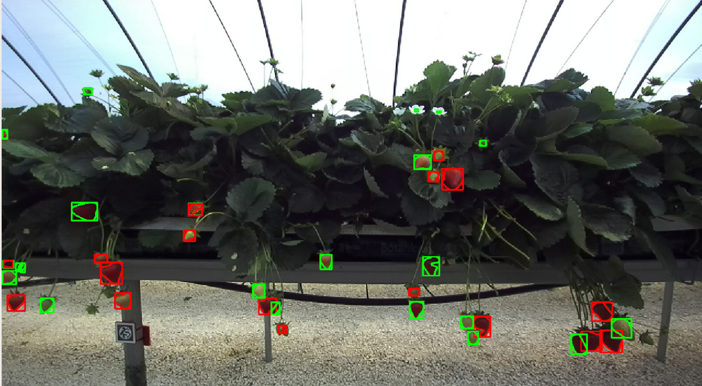

# AOC Fruit Detector using Detectron2 MaskRCNN

Instance segmentation of a scene and output Mask-RCNN predictions as images and json message/file (Agri-OpenCore), fully ROS2 integrated system.



## Installation, Requirements and Running

### Without Docker Installation

The docker container automatically installs all required dependencies. The main dependencises are listed below. However, without dockerisation, the following required packages or check/install required versions should be installed from requirements.txt file.

`python3` `torchvision` `pickle` `numpy` `opencv-python` `cv-bridge` `scikit-image` `matplotlib`
`detectron2` 

```
pip install -r requirements.txt
```
Detectron2 package is also automatically installed by Docker container. However, without dockerisation, it can be cloned from GitHub and installed into the workspace.

```
git clone https://github.com/facebookresearch/detectron2.git
python3 -m pip install -e detectron2
```

### Dockerised Installation

1. **Open in Visual Studio Code:**

    Open the cloned repository in VSCode. VSCode will prompt you to "Reopen in Container." Alternatively, you can use the command palette (`Ctrl+Shift+P`) and search for the "reopen in container" command.

   

2. **Accessing the Desktop Interface:**

    Open the user interface by navigating to the PORTS tab in VSCode, selecting port `6080` (or port `5801` for the CUDA-OpenGL version), and opening it in the browser.

   

3. **Getting Started: Build Packages**

    Build package with

    ```bash
    cd ${your_ws} && colcon build
    source install/setup.bash 
    ```

### Running

Run following to publish/save annotations detected by `aoc_fruit_detector` package.

```bash
ros2 launch aoc_fruit_detector fruit_detection.launch.py
```

## Parameters

The **config** folder contains two parameter files for specifying system characteristics: 
* **ros_params.yaml** allows tuning of ROS framework parameters.
* **non_ros_params.yaml** contains parameters for the fruit detection module.

### Key parameters

* **min_depth, max_depth**: Define the minimum and maximum depth values for the depth channel of the camera input.
* **constant_depth_value**: Used when no depth image or channel is available. This value is assumed as the distance between the camera and the detected fruit, enabling 3D pose estimation. This is particularly useful for RGB cameras without depth estimation capabilities. Default value is 1.0 m.
* **fruit_type**: Specifies the type of fruit to detect. Currently supported values are **"strawberry"** and **"tomato"**.
* **pose3d_frame**: Sets the frame ID for the 3D poses of the detected fruits.
* **pose3d_tf**: In some cases, camera_info message includes camera_frame rather than camera_optical_frame. In this case, the 3D pose estimated should be transformed from optical frame to camera frame. For transformation needed cases, set to `True`, otherwise keep as `False`. 
* **pub_verbose**: Publishes an annotated image as a `sensor_msgs/Image` message in the ROS2 framework.
* **verbose**: Determines which annotations appear on the annotated image. A Boolean list specifies the visualization of the following annotations in order: `[centroid, bounding box, mask, coordinate frames, text]`.
* **pub_markers**: To publish RViz markers in the ROS2 framework.
* **use_ros**: Specifies whether the fruit detection framework is integrated with the ROS2 framework.
  * If `False`, images are taken from the `test_image_dir` directory specified in **non_ros_params.yaml**, and the annotated images and JSON annotation files are saved to `prediction_output_dir` and `prediction_json_dir` directories, respectively.
  * If `True`, RGB and depth images are subscribed from camera topics, and annotations are published via ROS2 topics and as RViz markers.

Please note that annotated images and JSON annotation files are saved to the location where the package is installed. Check the **install** folder of the repository to find the annotation outputs.

## Wiki

To get more information about the AOC Fruit Detector, please refer to [Wiki page][wiki_page]

---

[wiki_page]: https://github.com/LCAS/aoc_fruit_detector/wiki