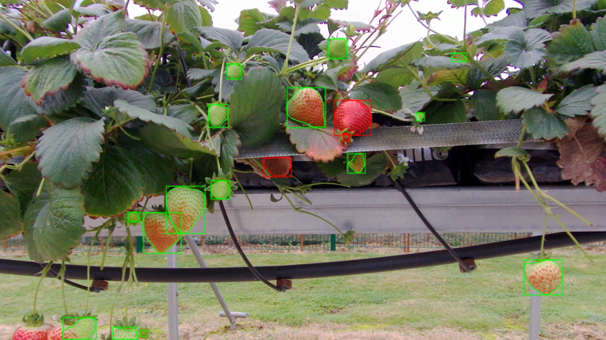

# AOC Fruit Detector using Detectron2 MaskRCNN

Instance segmentation of a scene and output Mask-RCNN predictions as images and json message/file (Agri-OpenCore)



## Installation and Requirements

Install following required packages or check/install required versions from requirements.txt file

`python3` `torchvision` `pickle` `numpy` `opencv-python` `cv-bridge` `scikit-image` `matplotlib`
`detectron2` 

```
pip install -r requirements.txt
```
Clone Detectron2 package from GitHub and install the package into your workspace.

```
git clone https://github.com/facebookresearch/detectron2.git
python -m pip install -e detectron2
```

## Usage

Run package to publish annotations detected by aoc_fruit_detector package 

```bash
ros2 launch aoc_fruit_detector fruit_detection.launch.py
```

If there is no depth channel, use a dummy depth value 

```bash
ros2 launch aoc_fruit_detector fruit_detection.launch.py constant_depth_value:=0.5
```

## Wiki

To get more information about the Fruit Detector, please refer to [Wiki page](https://github.com/usmanzahidi/FruitDetector/wiki)